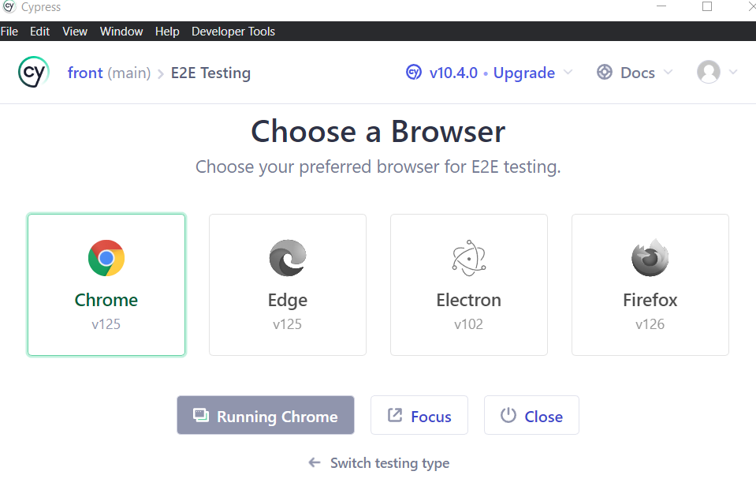
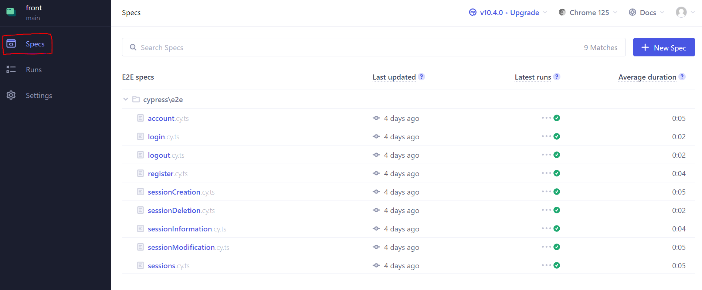

# Project5 - Yoga Application

Fifth project of OpenClassrooms Java/Angular Fullstack Training Course.

The original source code comes from [this repository in the OpenClassrooms Student Center](https://github.com/OpenClassrooms-Student-Center/Testez-une-application-full-stack).

## Development server

### Ressources

#### Postman collection

A Postman collection is available there: `ressources/postman/yoga.postman_collection.json`

Import can be done by following this documentation: 

https://learning.postman.com/docs/getting-started/importing-and-exporting-data/#importing-data-into-postman

#### MySQL

SQL script for creating the schema is available there: `ressources/sql/script.sql`

### Global Setup

_Requirements:_
- [Git](https://git-scm.com/book/en/v2/Getting-Started-Installing-Git)
- [Node >= 16.10.0](https://docs.npmjs.com/downloading-and-installing-node-js-and-npm)
- [OpenJDK8](https://openjdk.org/install/) or [Oracle JDK8](https://www.oracle.com/java/technologies/javase/javase8u211-later-archive-downloads.html)
- [MySQL Database >= 8.0](https://dev.mysql.com/doc/mysql-getting-started/en/)
- An IDE for Java ([Eclipse](https://eclipseide.org/)/[IntelliJ](https://www.jetbrains.com/idea/download/?section=windows)/etc.)

#### Setup DB

In my SQL command line (Or you can use a database tool like [DBeaver](https://dbeaver.io/)):

> mysql> CREATE DATABASE test; 

> mysql> USE test;

> mysql> SOURCE /path/to/file.sql

> mysql> CREATE USER 'user'@'localhost' IDENTIFIED BY '123456';

> mysql> GRANT SELECT, INSERT, UPDATE, DELETE ON test . * TO 'user'@'localhost';

You can change `user`, `password` or `database name` but you will have to change the `application.properties` in the back end project accordingly.

SQL script for creating the schema (the one used with SOURCE) is available there: `ressources/sql/script.sql`

#### Setup Back

- Clone the project (if you didn't do already):

> git clone https://github.com/JuFlajollet/project5-yoga-app

- Launch your preferred IDE and open the folder where you cloned the backend project.
- Check if you have correct JDK version for project (Java 8) and Maven.
- Download dependencies and build project through Maven:

> mvn clean install

- Run the application (`SpringBootSecurityJwtApplication.java`).

#### Setup and launch Front

- Clone the project (if you didn't do already):

> git clone https://github.com/JuFlajollet/project5-yoga-app

- Go inside front folder:

> cd front

- Install dependencies:

> npm install

- Launch Front-end:

> npm run start;

If you didn't install DB and launch the Back, you won't be able to go further than homepage, login and register.

By default, the admin user account that you can use to connect is:
- login: yoga@studio.com
- password: test!1234

## How to run tests

### Front unit and integration tests

Go to the root of the front app (project5-yoga-app/front) and open a terminal.

If you want to run a single test file:

> npx jest yourfile.ts 

If you want to run all tests:

> npx jest

### Back unit and integration tests

Open your IDE and use maven with the following command to run all tests:

> mvn clean test

You can also create a run configuration on a test class if you only want to run its specific tests.

### Front e2e tests

Go to the root of the front app (project5-yoga-app/front) and open a terminal.

> npm run e2e

Cypress should open and ask you which browser you want to use for your tests.

Once chosen, go to the specs menu on the left and then you can select which e2e test you want to run.

## How to generate coverage tests

### Front unit and integration tests

Go to the root of the front app (project5-yoga-app/front) and run the following command in terminal:

> npx jest --coverage

Results should show up in the terminal.

### Back unit and integration tests

Open your IDE and use maven with the following command:

> mvn clean test

You can find the report in the target folder: `target/site/jacoco/index.html` by opening the index.html file in a browser.

### Front e2e tests

Go to the root of the front app (project5-yoga-app/front) and run the following commands in terminal:

> npm run e2e

> npm run e2e:coverage

Results should show up in the terminal.

You can find a more detailed report in the coverage folder `coverage/lcov-report/index.html` by opening the index.html file in a browser.

(_If the coverage results seem low, you can try running e2e tests first through cypress so that the results are correctly updated._)